# Daniel Fernando Parra Diaz

 

<!-- TETRIS INVERSO: las fichas suben y se apilan. Generado con scripts/generate-tetris.py -->

 

**PIECE MANIFEST // CADA FICHA ES UN STACK**

Los colores del manifiesto coinciden con las piezas del tablero de arriba: azul, naranja, morado, amarillo, verde, rojo.

 

### 🟦 I · LENGUAJES

 

### 🟧 L · BACKEND

 

### 🟪 T · FRONTEND

 

### 🟨 O · INFRAESTRUCTURA

 

### 🟩 S · IA · DATA

 

### 🟥 Z · LIBRERÍAS

 

**ACTIVIDAD**

 

