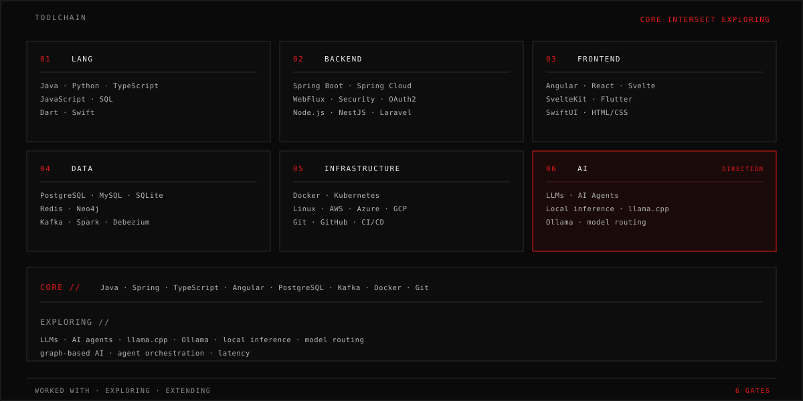
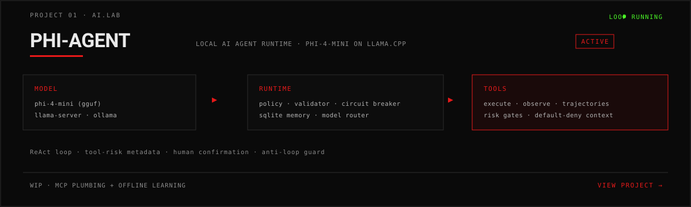
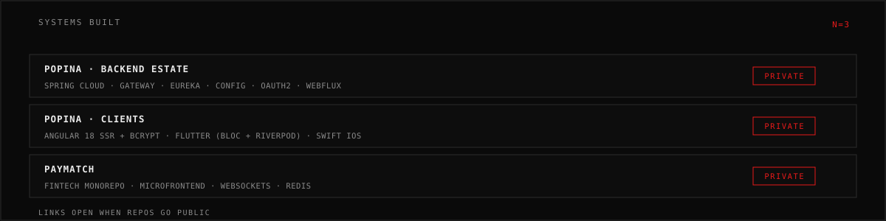

## [ TOOLCHAIN ]

## [ AI.LAB ]

[ PHI-AGENT →](https://github.com/danielferparradiaz/PHI-AGENT)

## [ BUILDS ]

## [ DATA ]

ETL · dimensional modeling · warehousing · 50K apps · star schemas · 763→756 verified

[workshop-1 →](https://github.com/danielferparradiaz/ETL_2026-2_Workshop-1) · [lab1-etl →](https://github.com/danielferparradiaz/Lab1-ETL) · [lab2 →](https://github.com/danielferparradiaz/ETL-Lab2)

## [ ENGINEERING ]

## [ BASE ]

[github.com/danielferparradiaz](https://github.com/danielferparradiaz) · [danielferparradiaz@gmail.com](mailto:danielferparradiaz@gmail.com)