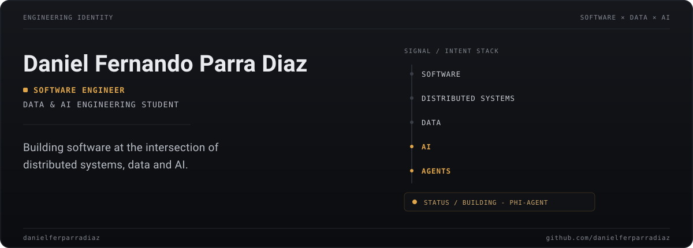
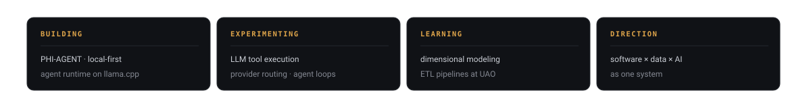
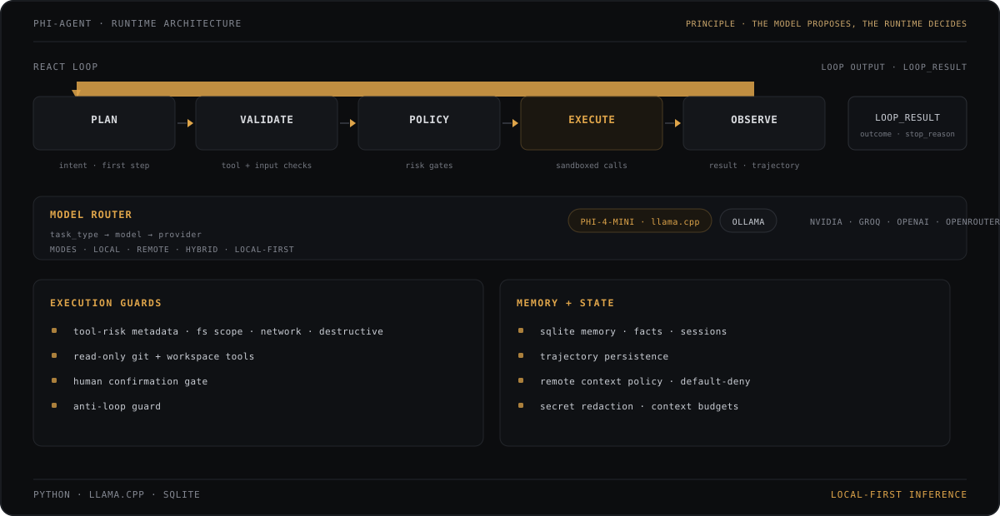

I design and build software systems end to end: microservices, applications, APIs and the data layer underneath them. Right now that focus is narrowing into one direction - systems where distributed engineering, data and AI meet.

## AI Lab

A general-purpose agent runtime for local-first AI. PHI-AGENT pairs a Phi-4-mini model running on llama.cpp with a runtime that owns tool execution, policy and memory.

**The model proposes. The runtime decides.**

| area | system |
|--------|--------|
| loop | ReAct - plan · validate · policy · execute · observe |
| local model | Phi-4-mini GGUF on llama.cpp (llama-server) or Ollama |
| routing | ModelRouter maps task type to model and provider |
| providers | openai-compatible remotes: NVIDIA · Groq · OpenAI · OpenRouter |
| memory | SQLite (facts, sessions) + trajectory persistence |
| tool safety | per-tool risk metadata · policy gates · anti-loop · default-deny remote context |

**Status:** active build. WIP: MCP plumbing and the offline learning pipeline.

[danielferparradiaz/PHI-AGENT →](https://github.com/danielferparradiaz/PHI-AGENT)

## Data Workbench

Public ETL and dimensional-modeling work from my Data & AI Engineering program at UAO. Each one starts from business requirements and ends in a verifiable warehouse.

| repo | build | evidence |
|------|-------|----------|
| [Workshop-1](https://github.com/danielferparradiaz/ETL_2026-2_Workshop-1) | business reqs to a dimensional warehouse. React dashboard + Python ETL + SQLite DW + FastAPI | 50k applications, star schema, R1-R5 traceability, zero orphan facts |
| [Lab1-ETL](https://github.com/danielferparradiaz/Lab1-ETL) | retail analytics across 3 branches from CSV, JSON and XML sources: profile, clean, integrate, validate, load | 763 raw transactions to 756 clean rows |
| [Lab2](https://github.com/danielferparradiaz/ETL-Lab2) | 2 stores plus online channel to a star-schema warehouse with requirement traceability | dimensions + fact loaded in dependency order |

## Systems Built

Production work I can't link yet. These live as private GitHub repos and will be linked here as they go public.

| system | what it is |
|--------|------------|
| **Popina backend** · PRIVATE | Spring Cloud microservices: API gateway, Eureka discovery, config server, OAuth2 authorization server, reactive services |
| **Popina clients** · PRIVATE | Angular 18 + SSR login with server-side bcrypt; Flutter apps (Bloc + Riverpod, clean architecture, maps); native iOS |
| **PayMatch** · PRIVATE | fintech monorepo: Angular host + chat microfrontend over a Spring estate with gateway, eureka, auth server, websockets, redis |

## How I Build

- **Architecture over heroes.** Systems composed of small, observable parts: gateway, registry, services.
- **Distributed by default.** Discovery, config and authorization are first-class concerns, not add-ons.
- **Data is a system too.** Pipelines and dimensional models get the same rigor as APIs.
- **Safety before speed.** Policy gates, default-deny, human confirmation: boundaries make systems reliable.
- **Automate the loop.** CI/CD and reproducible builds as the default path, not a side quest.
- **AI as infrastructure.** Local-first inference, agent loops and tool execution as another tier of the stack.

## Inside the Lab

| exploring | in the stack |
|-----------|--------------|
| local model serving | Spring Cloud microservices |
| agent orchestration | reactive services (WebFlux) |
| tool-safety boundaries | SSR frontends · Angular |
| small vs large models | Flutter apps |
| latency optimization | ETL · dimensional modeling |
| graph-based approaches | SQL |

## Toolchain

## Base

| experience | education |
|------------|-----------|
| **Full-Stack Developer · Carvajal Tecnología y Servicios** · innovation area. Angular, Figma to code, component libraries, user stories, reviews on Git/Azure | **Data & AI Engineering · Universidad Autónoma de Occidente** · current |
| **Junior Developer · Smart & Safe** · PHP/Laravel, generated Excel and PDF reports, Bootstrap interfaces | **Software Programming · technical degree** |

---

danielferparradiaz · [github.com/danielferparradiaz](https://github.com/danielferparradiaz) · [danielferparradiaz@gmail.com](mailto:danielferparradiaz@gmail.com)